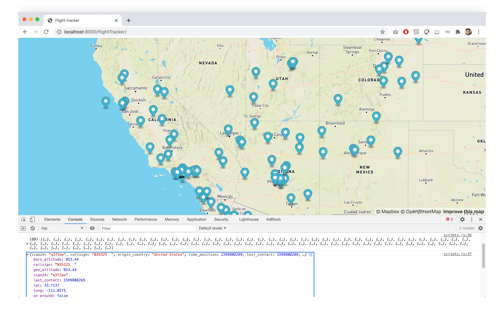

# Flight Tracker
*Started September 09, 2020*

Got the idea from the Geodose [Build Your Own Flight Tracking Application with Python and Open Air Traffic Data](https://www.geodose.com/2020/08/create-flight-tracking-apps-using-python-open-data.html) post I came across. The tutorial is built using Python, and I'm going to try to do it in JavaScript.

## Resources
- [Opensky Network](https://opensky-network.org/): Open air traffic data

## To do
- [x] Create an array of objects by combining the keys and values from [Opensky network REST response](https://opensky-network.org/api/states/all?lamin=30.038&lomin=-125.974&lamax=52.214&lomax=-68.748)
- [x] Place markers on map for each airplane

### Log
#### September 10, 2020
Two accomplishments today

1. Created structured data from the Opensky API response and then used that data to
2. Add markers to the map using the object's latitude and longitude

