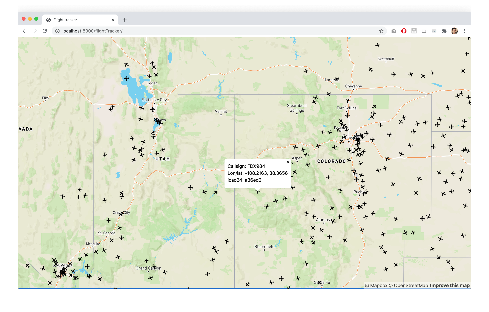

# Flight Tracker
*Started September 09, 2020*

*Published September 18, 2020*

https://mannylopez.github.io/flightTracker/

## 3D altitude map for current flights anywhere in the world

Got the idea to build a real-time flight tracker from Geodose's [Build Your Own Flight Tracking Application with Python and Open Air Traffic Data](https://www.geodose.com/2020/08/create-flight-tracking-apps-using-python-open-data.html) post. The tutorial is built using Python, and I'm going to try to do it in JavaScript.

## Resources
- [OpenSky Network](https://opensky-network.org/): Open air traffic data
- [OpenSky REST API docs](https://opensky-network.org/apidoc/rest.html)
- [How to make HTTP requests like a pro with Axios](https://blog.logrocket.com/how-to-make-http-requests-like-a-pro-with-axios/)
- [HTTP requests using Axios](https://flaviocopes.com/axios/)
- [bboxfinder.com](http://bboxfinder.com/#0.000000,0.000000,0.000000,0.000000)
- [A Guide to Solving Those Mystifying CORS Issues](https://blog.container-solutions.com/a-guide-to-solving-those-mystifying-cors-issues)
- [Where we're going, we don't need servers](https://oliverjam.es/blog/we-dont-need-servers/) on how to use Netlify and deploy a simple backend.
- [How do you convert normal geographic json coming from server into geoJson?](https://stackoverflow.com/questions/55496909/how-do-you-convert-normal-geographic-json-coming-from-server-into-geojson)
- [GeoJSON](https://en.wikipedia.org/wiki/GeoJSON) Wikipedia page
- [Geometric vs. Barometric Altitude](http://flysight.ca/wiki/index.php/Geometric_vs._Barometric_Altitude)

## To do
- [x] Create an array of objects by combining the keys and values from [Opensky network REST response](https://opensky-network.org/api/states/all?lamin=30.038&lomin=-125.974&lamax=52.214&lomax=-68.748)
- [x] Place markers on map for each airplane
- [x] Add plane marker with plane facing direction of travel
- [x] Add flight card with flight info when airplane is clicked
- [ ] Add plane trajectory
- [ ] Refresh flights automatically
- [ ] Add OpenSky attribution to page
- [ ] Design and add flight card with metadata

### Log
#### September 10, 2020

1. Created structured data from the Opensky API response and then used that data to
2. Add markers to the map using the object's latitude and longitude

#### September 11, 2020

1. Add plane marker with plane facing direction of travel
2. Add flight card with flight info when airplane is clicked
3. Notes:
    - The `/tracks` endpoint does not seem to be working
    - Found `/routes` and `/airports` endpoints by inspecting the network calls made in OpenSky Explorer](https://opensky-network.org/network/explorer)

#### September 13, 2020
Blocked by CORS policy: No 'Access-Control-Allow-Origin' header is present. The endpoints are not publicly available. Dang. Learnt more about CORS and why I can get results from those endpoints using Postman and my terminal, but not when using the browser.

#### September 14, 2020
Explored OpenSky's `/aircraft` endpoint and figured out that it does not return current flights. It returns data for flights that have started _and ended_. I need to find another API to get the current departure and arrival airport for any given flight.

#### September 15, 2020
I'm going to pause trying to get realtime data for a flight in progress. The API I found, [aviationstack](https://aviationstack.com/), provides a free tier for personal projects, but I would be exposing my private API key since my app is all frontend. I need to learn about servers and making the call in the backend. I'll come back to this once I learn how to work with servers.

#### September 17, 2020
Pivot! Since I can't get departure and arrival information for free, I'm going to work with the data I do have.

The map now shows 3D points representing the altitude of the plane. The layers are all generated from the GeoJSON file I create on the fly after receiving the data from the API call.

#### September 18, 2020
Finished product!

Map on load

After "Altitude" button is pressed

Pushing this to https://mannylopez.github.io/flightTracker/
