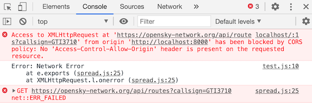
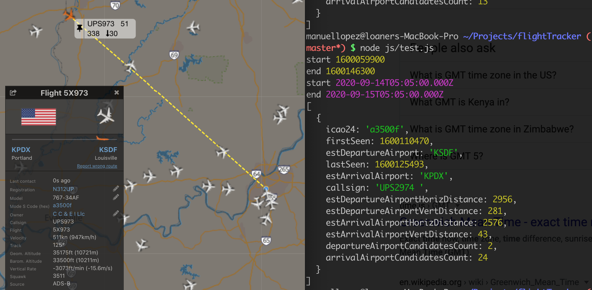

- [September 10, 2020](#september-10-2020)
- [September 11, 2020](#september-11-2020)
- [September 13, 2020](#september-13-2020)
- [September 14, 2020](#september-14-2020)
- [September 15, 2020](#september-15-2020)

# September 10, 2020
## Goals
- [x] Create an array of objects by combining the keys and values from [Opensky network REST response](https://opensky-network.org/api/states/all?lamin=30.038&lomin=-125.974&lamax=52.214&lomax=-68.748)
- [x] Place markers on map for each airplane

### Log
#### :white_check_mark: Create an array of objects by combining the keys and values from [Opensky network REST response](https://opensky-network.org/api/states/all?lamin=30.038&lomin=-125.974&lamax=52.214&lomax=-68.748)
Right now, the the flight data comes in through the `states` array in the response. I need to couple that the array of keys:

```js

let keys = ['icao24','callsign','origin_country','time_position','last_contact','long','lat','baro_altitude','on_ground','velocity','true_track','vertical_rate','sensors','geo_altitude','squawk','spi','position_source'];

```
with the values in the REST endpoint response (shortened here):
```JSON
{
  "time": 1599794990,
  "states": [
      [
          "aa56d8",
          "UAL2157 ",
          "United States",
          1599794989,
          1599794989,
          -114.6796,
          33.8198,
          10972.8,
          false,
          206.62,
          277.73,
          0,
          null,
          11506.2,
          "1610",
          false,
          0
      ],
      [
          "a7b07c",
          "FDX1314 ",
          "United States",
          1599794989,
          1599794989,
          -74.1831,
          40.661,
          495.3,
          false,
          91.69,
          177.11,
          14.63,
          null,
          533.4,
          "1705",
          false,
          0
      ]
    ]
}
```
by using a for loop:
```js
let flightsArray = [];
let values = response.data.states;

for (let y = 0; y < values.length; y++) {
  let state = values[y];
  let obj = {};
  for (let x = 0; x < state.length; x++) {
    obj[keys[x]] = state[x];
  }
  flightsArray.push(obj)
}
```
Result:
```js
[
  {
    icao24: 'aa56d8',
    callsign: 'UAL2157 ',
    origin_country: 'United States',
    time_position: 1599796979,
    last_contact: 1599796979,
    long: -117.7826,
    lat: 33.8106,
    baro_altitude: 1173.48,
    on_ground: false,
    velocity: 108.59,
    true_track: 213.01,
    vertical_rate: -5.53,
    sensors: null,
    geo_altitude: 1219.2,
    squawk: '2627',
    spi: false,
    position_source: 0
  },
  {
    icao24: 'a3f2ae',
    callsign: 'N35325  ',
    origin_country: 'United States',
    time_position: 1599796979,
    last_contact: 1599796979,
    long: -111.9828,
    lat: 33.4935,
    baro_altitude: 1493.52,
    on_ground: false,
    velocity: 56.19,
    true_track: 176.33,
    vertical_rate: 0,
    sensors: null,
    geo_altitude: 1554.48,
    squawk: '4376',
    spi: false,
    position_source: 0
  }
```
Success! :tada:

#### :white_check_mark: Place markers on map for each airplane
I can now take the array of objects and iterate over each array and add a marker to the map
```javascript
// Add a marker for each flight
for (let flight of flightsArray) {
  let marker = new mapboxgl.Marker()
    .setLngLat([flight.long, flight.lat])
    .addTo(map);
  }
```

# September 11, 2020
## Goals
- [x] Add plane marker with plane facing direction of travel
- [x] Add flight card with flight info when airplane is clicked

### Log
Now that I have near real-time flight data, I want to plot a trajectory to the destination airport.

OpenSky's [REST API documentation](https://opensky-network.org/apidoc/rest.html) shows a GET /tracks endpoint, but I can't get it to work. I tried their example as well as trying to craft my own query, but I get back a 404. Either I don't know what I'm doing (most likely scenario), or that endpoint is not working?

I poked around the [OpenSky Explorer](https://opensky-network.org/network/explorer) using the Network tab inChrome Developer tools, and I found a couple of endpoints that will help.

Unfortunately, OpenSky does not return an actual flight path. Best I can do is figure out what the destination airport is and draw a straight line there.

(I seem to recall that you can't draw a straigh line on a map, since the world is curved. I'll cross this bridge when I get to it)

**Endpoints**:

GET `/routes`: https://opensky-network.org/api/routes?callsign=KLM281

Response:
```js
callsign: "KLM281"
flightNumber: 281
operatorIata: "KL"
route: ["EHAM", "KSFO"]
  0: "EHAM"
  1: "KSFO"
updateTime: 1599831170000
```
GET `/airports`: https://opensky-network.org/api/airports/?icao=KSFO

Response:
```js
city: null
continent: "NA"
country: "US"
gpsCode: "KSFO"
homepage: "http://www.flysfo.com/"
iata: "SFO"
icao: "KSFO"
municipality: "San Francisco"
name: "San Francisco International Airport"
position: {longitude: -122.375, latitude: 37.61899948120117, altitude: 3.9624, reasonable: true}
  altitude: 3.9624
  latitude: 37.61899948120117
  longitude: -122.375
  reasonable: true
region: "US-CA"
type: null
wikipedia: "http://en.wikipedia.org/wiki/San_Francisco_International_Airport"
```

**Workflow**:

1. User clicks on plane icon
2. Onclick, the flight callsign is passed to the `/routes` endpoint
3. The response includes the destination airport ICAO24 unique transponder address
4. Pass the destination airport ICAO24 address to the `/airports` endpoint
5. the response includes the destination airport latitude and longitude
6. Draw a straight line from flight lat/lon to airport lat/lon

# September 13, 2020

Welp, I learned that I can't just find an API endpoint and expect to have access to it. Although I can get results using my terminal, I get the following error when it goes through Chrome.



OpenSky does not offer the GET `/airports` and GET `/routes` as part of the API offering, so it makes sense my localhost:8000 hits a CORS error. Oh well. I'll need to make do with the actual API offerings. I wonder why OpenSky's `/tracks` endpoint is not working for me?

# September 14, 2020

[Get Track by Aircraft returns nothing](https://opensky-network.org/forum/application-programming-interface/382-get-track-by-aircraft-returns-nothing)

The `/tracks` API is indeed deactivated. Has been for at least a year by now.

_9:58 PM_

The GET `/flights/aircraft` endpoint does not seem to return current flights. The call parameters take a start and end of time interval to retrieve flights, but the response returns flights that have departed _and landed_ during the start and end parameters passed.

Image on the left shows the current flight of aircraft ICAO24 code [a3500f](https://opensky-network.org/aircraft-profile?icao24=a3500f) from KPDX (Portland, OR) to KSDF (Louisville, KY).

Image on the right is the API response for the same time. Note that it returns the last fligth that aircraft completed, from KSDF _to_ KPDX.

Notice that the callsign for the flights is different.
The callsign for the current fligth is [UPS973](https://flightaware.com/live/flight/UPS2973) and the callsign for the completed flight is [UPS974](https://flightaware.com/live/flight/UPS2974)



I wonder when the OpenSky API returns the completed fligth. This flight is landing in 12 minutes (time now: 10:23 PM), so I'll check then.

Since I can't get the current destination from OpenSky's API, I'm going to look for another free API.

_10:27 PM_

To test out my theory that GET `/airports` and GET `/routes` because I'm not allowed to, I tested the GET `/flights/aircraft` call from my browser instead of my terminal, and it worked, so that definitely means that the two previous endpoints are not public.

_10:42 PM_

Tested the `/aircraft` endpoint just now and it is still returning the previous fligth from KSDF to KPDX.

I need to find another API to get the current departure and arrival airport for any given flight.

# September 15, 2020

All of the flight API's pay for usage, but I did find [aviationstack](https://aviationstack.com/) that has a free tier for personal projects. I'm going to pause trying to get realtime data right now since my API key would be exposed seeing as this is a frontend app. I need to learn how to make the API call in a server, so I'll come back to that.

I'm going to try and do with the data that Opensky returns.
